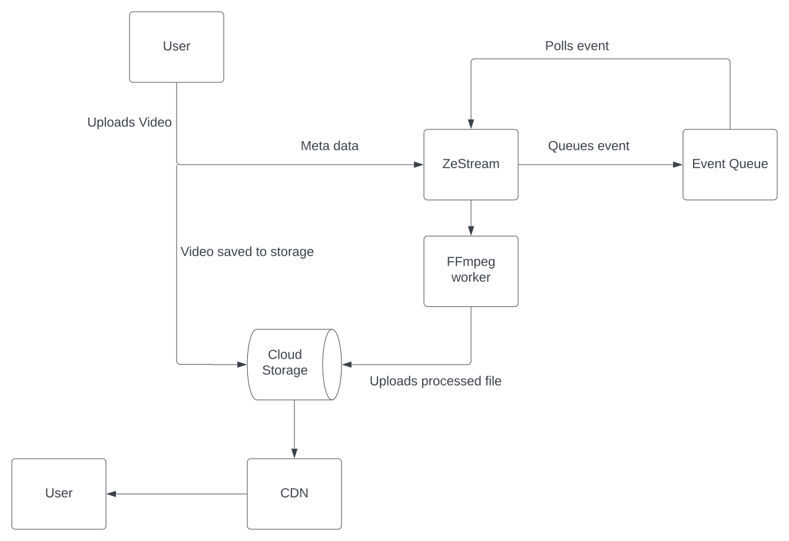

# ZeStream - An adaptive video streaming server

## What is adaptive video streaming?

Ever wonder how Youtube/Netflix/Tiktok changes the resolution of the video you are watching depending on your network speed?

Do you want to implement a similar feature in your product, without any hassle?

> **ZeStream is the backend service which you can self-deploy, and use its API to process the video and store it on a storage bucket like AWS S3/Google Cloud/Azure...**

## Architecture

## Implementation

1. The user calls API to process the video.
2. The API controller queues the event in a message queue (Kafka) and calls the provided webhook.
3. A ZeStream worker polls the event from the queue containing the file URL
4. The worker fetches the file to the local disk
5. Another worker starts an FFmpeg thread to process the video
6. Output is stored in the local disk
7. After FFmpeg finishes processing, another worker pushes the files to cloud storage
8. CDN is connected to storage for fetching the files.

## Dev Setup

1. Install Golang v1.19 from [Go.dev](https://go.dev/doc/install)
2. Fork this repo, and clone the forked repo
3. `cd zestream-server`
4. `go get .`
5. `go run main.go`

## How to contribute?

Check out [contribution guidelines](https://github.com/ZeStream/zestream-server/blob/main/CONTRIBUTING.md)
